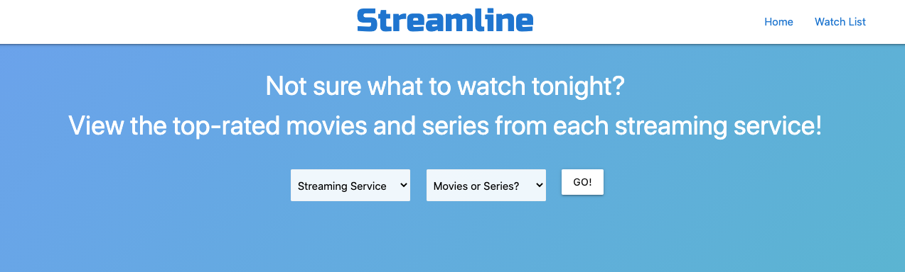

# Group Members

Scott S.  
Michelle B.  
Amara S.  
Ali A.

TITLE
Streamline

DESCRIPTION
movie database to pull top 10 movies from any given year.
is movie currently streaming - where

USER STORY
As someone looking for something to do, I want to search top movies ever made by any given year. So that I can decide on a movie to watch.

As a trivia nut, I want to search top movies ever made by any given year and see various details about that movie.

APIs used
IMDB - rapid api
OTT - rapid api

ACCEPTAINCE CRITERIA
GIVEN an opening movie dashboard with a form input for year
WHEN I enter a year, a list of the top ten movies for that year appear
THEN when I click on the movie I am presented with detailed information about that movie
WHEN I click the save button
THEN movies I want to see are saved to "My movies"

Project Link  
https://asa151930.github.io/Project-1/

Preview:
